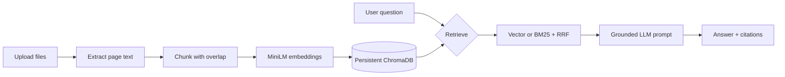

# DocuMind

DocuMind is a RAG-based document Q&A app that answers from uploaded PDFs, text, and Markdown files with inspectable citations and a reproducible retrieval evaluation harness.

[](https://github.com/KavyanshSharma09/documind-rag/actions/workflows/ci.yml)

## Features

- Upload one or more PDF, TXT, or Markdown files in Streamlit.
- Extract PDF text page by page, chunk it with configurable size and overlap, and persist embeddings in local ChromaDB.
- Ask questions in a chat interface with file, page, and expandable source-chunk citations.
- Choose vector retrieval or hybrid BM25 plus vector retrieval fused with Reciprocal Rank Fusion.
- Use Groq, Gemini, or local Ollama through one provider abstraction.
- Evaluate six retrieval configurations with hit rate@k, MRR, and optional LLM-as-judge scoring.

## Architecture



## Tech stack

Python 3.10+, Streamlit, pypdf, sentence-transformers, ChromaDB, rank-bm25, Groq, Gemini, Ollama, pytest, and GitHub Actions.

## Run locally

```powershell
python -m venv .venv
.venv\Scripts\Activate.ps1
python -m pip install -r requirements.txt
Copy-Item .env.example .env
# Edit .env and set LLM_PROVIDER plus the matching API key, or use Ollama.
streamlit run app.py
```

The first run downloads `all-MiniLM-L6-v2`. The Chroma index is persisted in `data/chroma/` and is ignored by Git.

## Docker

```powershell
docker build -t documind .
docker run --rm -p 8501:8501 --env-file .env -v ${PWD}\data:/app/data documind
```

Open `http://localhost:8501`.

## Evaluation

The sample handbook is generated with `python scripts/generate_sample_pdf.py`. Run the retrieval sweep with:

```powershell
python eval/run_eval.py
# Add --judge to use the configured LLM for 1-5 answer-quality scores.
```

The runner tests vector and hybrid retrieval at chunk sizes 400, 800, and 1200, writes `eval/results.csv`, and prints a Markdown table. Fill this table after running it locally:

| mode | chunk size | hit rate@k | MRR | answer quality |
| --- | ---: | ---: | ---: | ---: |
| vector | 400 | TBD | TBD | TBD |
| vector | 800 | TBD | TBD | TBD |
| vector | 1200 | TBD | TBD | TBD |
| hybrid | 400 | TBD | TBD | TBD |
| hybrid | 800 | TBD | TBD | TBD |
| hybrid | 1200 | TBD | TBD | TBD |

## What I learned / design decisions

- Smaller chunks improve pinpoint retrieval but can lose surrounding explanation; larger chunks preserve context but dilute ranking. The 800/100 default is a practical middle ground.
- BM25 catches exact names, acronyms, and rare terms that semantic embeddings can miss. RRF combines that lexical precision with vector recall without requiring score calibration.
- Page metadata stays attached to every chunk so citations are generated from retrieval records rather than guessed after generation.
- The prompt is centralized and explicitly forbids unsupported claims. Missing context produces `I couldn't find this in the documents.`

## Limitations and future work

The index is local and single-process, OCR is not included for scanned PDFs, and the BM25 index is rebuilt in memory when the app starts or ingests files. Future work includes OCR, multi-user storage, streaming responses, reranking, document deletion, and a hosted evaluation dashboard.

Demo GIF: `docs/demo.gif` (placeholder)

Live demo: Hugging Face Spaces placeholder

## Tests

```powershell
python -m pytest -q
```

Tests use no API calls and cover chunking, vector dispatch seams, BM25, and RRF behavior.
